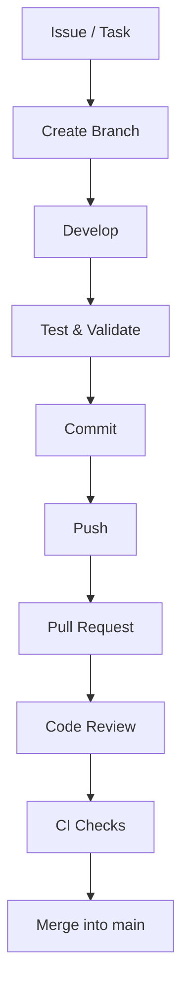

# Contributing Guide

Thank you for contributing to the **Smart India Hackathon 2026 — Problem Statement 26090** project.

This repository contains the AI pipeline, backend services, web frontend, mobile application, and shared packages. The project is developed collaboratively, so keeping changes organized, tested, and consistent is important.

## 1. Repository Structure

```text
.
├── apps/
│   ├── api/          # Backend API and server-side logic
│   ├── mobile/       # Mobile application
│   └── web/          # Web frontend
│
├── packages/
│   ├── brand/        # Shared branding and design resources
│   └── contracts/    # Shared types, schemas and API contracts
│
├── seed/             # Seed and development data
├── docs/             # Project documentation
│
├── .github/          # GitHub configuration and workflows
├── docker-compose.yml
├── .env.example
├── .gitignore
├── LICENSE
└── README.md
```

## 2. Before You Start

Before contributing:

1. Read the relevant documentation under `docs/`.
2. Check existing issues and pull requests to avoid duplicate work.
3. Make sure the project runs successfully on your machine.
4. Configure your local environment using `.env.example`.
5. Pull the latest changes from `main`.
6. For non-trivial changes, create or reference an issue/task before starting implementation.

If you are unsure which part of the repository a change belongs to, coordinate with the relevant component owner before starting.

## 3. Development Workflow

Use the following workflow for changes:


Before starting work, make sure your local repository is up to date:

```bash
git checkout main
git pull origin main
```

Create a separate branch for your work:

```bash
git checkout -b feature/<short-description>
```

Examples:

```bash
git checkout -b feature/authentication
git checkout -b feature/speech-pipeline
git checkout -b fix/api-validation
```

Avoid making feature changes directly on the `main` branch.

## 4. Branch Naming

Use short and descriptive branch names.

| Type          | Format              | Example                   |
| ------------- | ------------------- | ------------------------- |
| Feature       | `feature/<name>`    | `feature/user-auth`       |
| Bug fix       | `fix/<name>`        | `fix/login-error`         |
| Refactor      | `refactor/<name>`   | `refactor/api-structure`  |
| Documentation | `docs/<name>`       | `docs/api-setup`          |
| Experiment    | `experiment/<name>` | `experiment/speech-model` |

Keep branch names lowercase, concise, and descriptive.

## 5. Making Changes

Keep changes focused.

A single pull request should preferably address one feature, bug, refactor, experiment, or documentation change.

Before committing:

1. Check the files you changed.
2. Remove debugging code and unnecessary files.
3. Remove unused imports and variables.
4. Make sure secrets and credentials are not included.
5. Run relevant tests and checks.
6. Verify that the affected application still starts correctly.
7. Check that no unrelated files have been modified.

Review your changes with:

```bash
git status
git diff
```

Avoid mixing unrelated changes into the same branch or pull request.

## 6. Environment Variables and Secrets

Never commit secrets, API keys, passwords, tokens, private keys, or production credentials.

Use `.env` for local configuration:

```bash
cp .env.example .env
```

The `.env` file must remain untracked.

If a new environment variable is required, add its placeholder to `.env.example`.

For example:

```env
API_KEY=
DATABASE_URL=
JWT_SECRET=
```

Do not put real values in `.env.example`.

Also do not commit sensitive project or user data, including:

* User information
* Authentication/session data
* Production database dumps
* Private uploaded media
* Private datasets
* Credentials contained in logs or configuration files

If a secret is accidentally committed, do not simply delete it from the latest commit. Notify the maintainers immediately so the credential can be revoked or rotated.

## 7. Files and Artifacts That Should Not Be Committed

Do not commit generated, temporary, or environment-specific files unless explicitly required by the project.

Examples include:

```text
.env
node_modules/
dist/
build/
.venv/
__pycache__/
*.pyc
temporary files
local logs
IDE-specific files
model caches
generated outputs
```

Large datasets, trained model weights, generated artifacts, and other large binaries should not be committed unless explicitly approved and handled through the project's designated storage mechanism.

Keep `.gitignore` updated when introducing new generated or local-only files.

## 8. Code Quality

Follow the conventions already established in the relevant application.

Before submitting a pull request:

* Remove unused imports and variables.
* Keep functions and modules focused.
* Avoid unnecessary duplication.
* Add appropriate error handling.
* Keep API contracts synchronized with their consumers.
* Avoid unrelated changes.
* Prefer simple solutions over unnecessary abstraction.
* Document non-obvious implementation decisions.
* Run formatting, linting, and type-checking tools when configured.

Do not introduce a new framework, library, architectural pattern, or abstraction without a clear reason.

## 9. Testing

Add or update tests when modifying application logic.

Backend tests should be placed under:

```text
apps/api/tests/
```

Run the relevant test suite before opening a pull request.

Example:

```bash
pytest
```

If your change affects the web or mobile application, also verify the relevant build and functionality locally.

Depending on the affected component, validation may include:

* Unit tests
* Integration tests
* API tests
* Type checking
* Linting
* Formatting
* Application builds
* Manual UI verification

Do not mark a change as tested if it has only been reviewed visually or if the relevant test suite was not actually executed.

## 10. AI/ML Contributions

Changes to the AI pipeline require additional care because model behavior can depend on data, preprocessing, configuration, and model versions.

When modifying AI/ML components:

* Document the model and relevant version.
* Document important preprocessing and inference assumptions.
* Keep training and inference processes reproducible where practical.
* Document significant model or configuration changes.
* Record relevant evaluation metrics for meaningful model changes.
* Document dataset provenance where applicable.
* Do not commit private, proprietary, or sensitive datasets.
* Do not commit large model weights unless explicitly approved.
* Do not claim model accuracy without supporting evaluation results.
* Clearly distinguish experimental changes from production-ready changes.

For experiments, prefer branches such as:

```bash
git checkout -b experiment/<short-description>
```

Experimental work should not be merged into `main` unless it is sufficiently validated and intended for the project.

## 11. API and Shared Contracts

Changes to API request or response structures can affect both the web and mobile applications.

If you modify an API contract:

1. Update the shared definitions under `packages/contracts/` where applicable.
2. Update the backend implementation.
3. Update affected web and mobile API clients.
4. Update relevant tests.
5. Update documentation where necessary.
6. Check backward compatibility.

The expected dependency flow is:

```text
packages/contracts
        ↓
   ┌────┴────┐
   ↓         ↓
apps/api   Client Apps
             ├── web
             └── mobile
```

Avoid silently changing existing API behavior.

Breaking API changes must be explicitly documented in the pull request.

## 12. Commit Messages

This project follows the **Conventional Commits** style:

```text
<type>[optional scope]: <description>
```

Examples:

```text
feat: add user authentication
feat(api): add speech verification endpoint
fix: handle invalid API requests
refactor: simplify speech adapter
docs: update backend setup
test: add authentication tests
chore: update dependencies
ci: update GitHub Actions workflow
```

Use imperative, concise, and descriptive messages.

Avoid messages such as:

```text
update
changes
final
final2
working
test
```

For breaking changes, clearly indicate the change in the commit and pull request.

Example:

```text
feat(api)!: update authentication response format
```

Commits should represent logical changes. Avoid combining unrelated features, fixes, and refactors into a single commit.

## 13. Keeping Your Branch Updated

Before opening or updating a pull request, make sure your branch is reasonably up to date with `main`.

Preferred workflow:

```bash
git checkout main
git pull origin main

git checkout feature/<your-branch>
git rebase main
```

Resolve conflicts carefully and run the relevant tests again after rebasing.

Do not rewrite the history of another contributor's branch.

## 14. Pull Requests

Push your branch:

```bash
git push -u origin feature/<short-description>
```

Open a Pull Request against:

```text
main
```

The pull request should contain:

* A clear title.
* A short description of the changes.
* The related issue/task where applicable.
* Testing performed.
* Relevant screenshots or recordings for UI changes.
* Any known limitations.
* Any follow-up work required.
* Notes about API or database changes where applicable.

Example PR title:

```text
feat: add speech-based authentication flow
```

For significant changes, explain:

```text
What changed?
Why was it changed?
How was it tested?
Are there any known limitations?
```

Keep pull requests focused and reasonably small.

## 15. Pull Request Checklist

Before requesting a review:

## Pull Request Checklist

* [ ] Code follows the existing project structure
* [ ] Branch follows the naming convention
* [ ] No secrets or credentials are committed
* [ ] No sensitive user or production data is committed
* [ ] Generated files and unnecessary artifacts are excluded
* [ ] Tests have been added or updated where required
* [ ] Relevant tests pass locally
* [ ] Formatting and linting pass where configured
* [ ] Documentation has been updated if necessary
* [ ] API contracts are synchronized if changed
* [ ] AI/ML changes include relevant evaluation information
* [ ] Debugging code has been removed
* [ ] Changes are limited to the intended scope
* [ ] CI checks pass


## 16. Code Review

Pull requests should be reviewed before merging into `main`.

Reviewers should check:

* Correctness
* Security
* Code quality
* Test coverage
* API compatibility
* Performance where relevant
* Maintainability
* Error handling
* Data handling
* Documentation
* Scope of the change

Reviewers should focus on the code and provide specific, actionable feedback.

Address review comments before merging.

Contributors should not merge their own pull requests unless explicitly authorized by the project maintainers.

Changes affecting authentication, security, infrastructure, shared contracts, or production deployment should receive additional review where appropriate.

## 17. Merging

Do not merge a pull request until:

* Required reviews are complete.
* CI checks pass.
* Major review comments are resolved.
* Relevant tests pass.
* The branch is up to date with `main` where necessary.

Pull requests should generally be **squash-merged** into `main` to keep the main branch history clean.

The final merge commit should follow the project's commit message convention.

Keep `main` stable and in a deployable state whenever practical.

## 18. Reporting Issues

When reporting a bug, provide:

* A clear description of the problem.
* Steps to reproduce it.
* Expected behavior.
* Actual behavior.
* Relevant logs or error messages.
* Environment information where relevant.
* Screenshots or recordings where useful.
* The affected application or component.

Example:

```text
Component: apps/api

Problem:
API returns a 500 response when an invalid authentication token is supplied.

Steps to reproduce:
1. Start the API.
2. Send a request to /api/...
3. Provide an invalid token.

Expected:
The API returns an appropriate authentication error.

Actual:
The API returns HTTP 500.
```

For security vulnerabilities or exposed credentials, do not publish sensitive information in a public issue. Contact the project maintainers privately.

## 19. Component Ownership

Changes should be coordinated with the contributors responsible for the affected component.

| Component            | Area                                    |
| -------------------- | --------------------------------------- |
| `apps/api`           | Backend and API                         |
| `apps/web`           | Web frontend                            |
| `apps/mobile`        | Mobile application                      |
| AI pipeline          | AI/ML processing and models             |
| `packages/contracts` | Shared types, schemas and API contracts |
| `packages/brand`     | Shared branding and design resources    |
| `.github/`           | CI/CD and repository automation         |
| `docs/`              | Project documentation                   |

Ownership does not prevent other contributors from making changes. It helps identify the appropriate people for review and coordination.

## 20. General Guidelines

Keep the following principles in mind:

* Keep `main` stable.
* Keep pull requests focused.
* Prefer simple solutions over unnecessary complexity.
* Document non-obvious decisions.
* Test changes before submitting them.
* Never commit secrets or sensitive data.
* Do not commit private datasets or unauthorized user data.
* Keep large generated artifacts out of Git unless explicitly approved.
* Coordinate changes that affect multiple applications.
* Keep shared contracts consistent across Web, Mobile, and Backend.
* Do not silently introduce breaking API changes.
* Separate experimental work from production-ready changes.
* Communicate changes that affect other contributors.
* Prioritize correctness and maintainability over speed of implementation.

---

## Project

**Smart India Hackathon 2026 — Problem Statement 26090**

This project is developed collaboratively as part of the SIH 2026 submission.

The goal of this contributing guide is to keep development consistent across the AI pipeline, backend, web frontend, mobile application, and shared packages while keeping the contribution process lightweight and practical.

## Contributors

## 👥 Project Team

<table align="center" border="1" cellpadding="12" cellspacing="0">
  <tr>
    <td align="center">
      <a href="https://github.com/noNameDS09">
        
        <br />
        <b>noNameDS09</b>
      </a>
    </td>
    <td align="center">
      <a href="https://github.com/aj-codespy">
        
        <br />
        <b>Ayush Jha</b>
      </a>
    </td>
    <td align="center">
      <a href="https://github.com/insop31">
        
        <br />
        <b>insop31</b>
      </a>
    </td>
    <td align="center">
      <a href="https://github.com/Renka1818">
        
        <br />
        <b>Renuka</b>
      </a>
    </td>
    <td align="center">
      <a href="https://github.com/ShadowMonarch9099">
        
        <br />
        <b>Kush Honkalse</b>
      </a>
    </td>
    <td align="center">
      <a href="https://github.com/shivam512262">
        
        <br />
        <b>Shivam Patil</b>
      </a>
    </td>
  </tr>
</table>

<p align="center">
  <sub>
    Built collaboratively for <b>Smart India Hackathon 2026</b>
  </sub>
</p>

