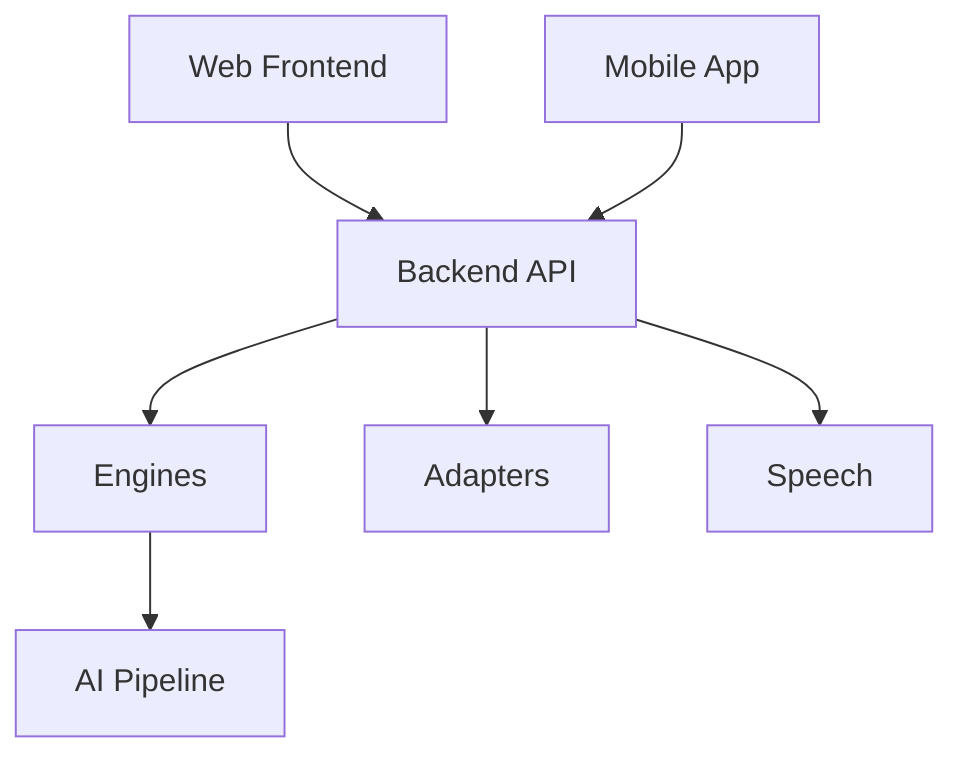

# SIH 2026 — Problem Statement 26090

This repository contains the source code and supporting modules for **Smart India Hackathon (SIH) 2026 — Problem Statement 26090**.

The project is organized as a modular monorepo containing the AI pipeline, backend services, web frontend, mobile application, shared packages, and seed data.

**Coding agents:** start at [`agent-coding-guide/README.md`](./agent-coding-guide/README.md) (also linked from [`AGENTS.md`](./AGENTS.md)). That folder is the implementation source of truth.

## Repository Structure

```text
.
├── apps/
│   ├── api/
│   │   └── src/
│   │       └── kalasetu_api/
│   │           ├── routers/
│   │           │   └── auth.py
│   │           ├── engines/
│   │           └── adapters/
│   │               └── speech/
│   │
│   ├── mobile/
│   │   └── lib/
│   │       ├── ui/
│   │       ├── voice/
│   │       └── api/
│   │
│   └── web/
│       └── src/
│           ├── ui/
│           ├── voice/
│           └── api/
│
├── packages/
│   ├── brand/
│   └── contracts/
│
├── seed/
│
├── agent-coding-guide/   # Source of truth for coding agents (read this first)
├── AGENTS.md
│
├── docs/
│
├── .github/
│
├── docker-compose.yml
├── .env.example
├── .gitignore
├── LICENSE
└── README.md
```

## Directory Overview

### `apps/`

Contains the main applications that make up the system.

### `apps/api/`

Contains the backend API and server-side application.

```text
apps/api/
└── src/
    └── kalasetu_api/
```

The backend is divided into separate modules to keep API routes, processing engines, and external integrations isolated.

* `routers/` — API route definitions and request handling.
* `engines/` — Core processing and business logic.
* `adapters/` — Integrations and adapters for external services.
* `adapters/speech/` — Speech-related services and integrations.
* `auth.py` — Authentication-related API routes and logic.

### `apps/mobile/`

Contains the mobile application.

* `ui/` — Mobile UI components and screens.
* `voice/` — Voice-related functionality.
* `api/` — Communication between the mobile application and backend APIs.

### `apps/web/`

Contains the web frontend.

* `ui/` — Web UI components and pages.
* `voice/` — Voice interaction functionality.
* `api/` — Frontend API clients and backend communication.

### `packages/`

Contains shared modules used across different applications.

* `brand/` — Shared branding, design assets, themes, and visual constants.
* `contracts/` — Shared API contracts, schemas, types, and interfaces.

Keeping these modules separate allows the web, mobile, and backend applications to share common definitions without unnecessary duplication.

### `seed/`

Contains seed data used for development, testing, initialization, or database population.

Do not place private, proprietary, or sensitive user data in this directory.

### `docs/`

Contains project documentation, including architecture notes, API documentation, development guides, and other technical documentation.

### `docker-compose.yml`

Defines the containerized services required to run the project locally or as part of the development environment.

## Architecture

At a high level, the repository follows this structure:



The web and mobile applications communicate with the backend API. The backend coordinates core processing, external integrations, speech functionality, and the AI pipeline.

Shared contracts provide common definitions across the backend and client applications.

## Development

The repository is structured so that individual applications and services can be developed independently while sharing common contracts and branding through `packages/`.

For development:

```bash
git clone <repository-url>
cd <repository-directory>

cp .env.example .env
```

Additional setup and service-specific instructions are maintained in the project documentation.

Before making changes, contributors should ensure their local repository is up to date and work on a dedicated branch rather than directly on `main`.

## Contributing

Contributions should follow the project's development, testing, branching, commit, review, and security conventions.

See **[CONTRIBUTING.md](CONTRIBUTING.md)** for the complete contribution workflow and guidelines.

The contributing guide covers:

* Repository workflow
* Branch naming
* Commit conventions
* Testing and code quality
* Environment variables and secrets
* AI/ML contribution guidelines
* API and shared contracts
* Pull requests
* Code review
* Merging
* Issue reporting
* Component ownership

For non-trivial changes, contributors should create or reference an issue/task before implementation.

## Project Status

🚧 **Active Development**

This repository is currently under development for **SIH 2026 — Problem Statement 26090**.

Architecture, APIs, AI components, and application modules may evolve as development progresses.

## Documentation

Project documentation is maintained under:

```text
docs/
```

Additional documentation will be added as the project develops, including:

* System architecture
* Development setup
* API documentation
* AI pipeline details
* Model and evaluation information
* Deployment instructions
* Technical decisions

## License

This project is licensed under the **MIT License**.

See [`LICENSE`](LICENSE) for details.
