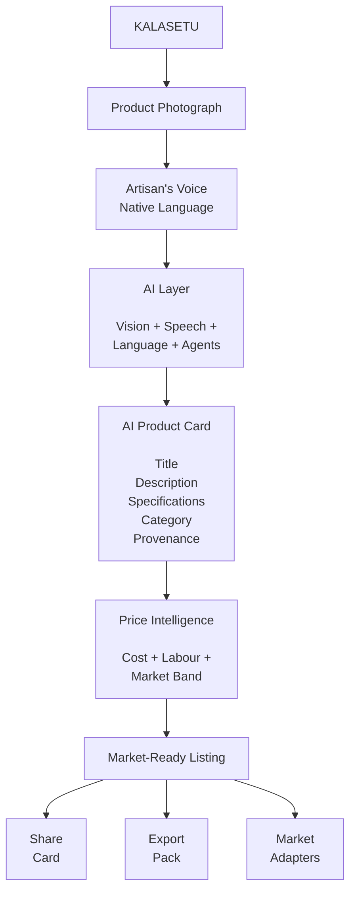
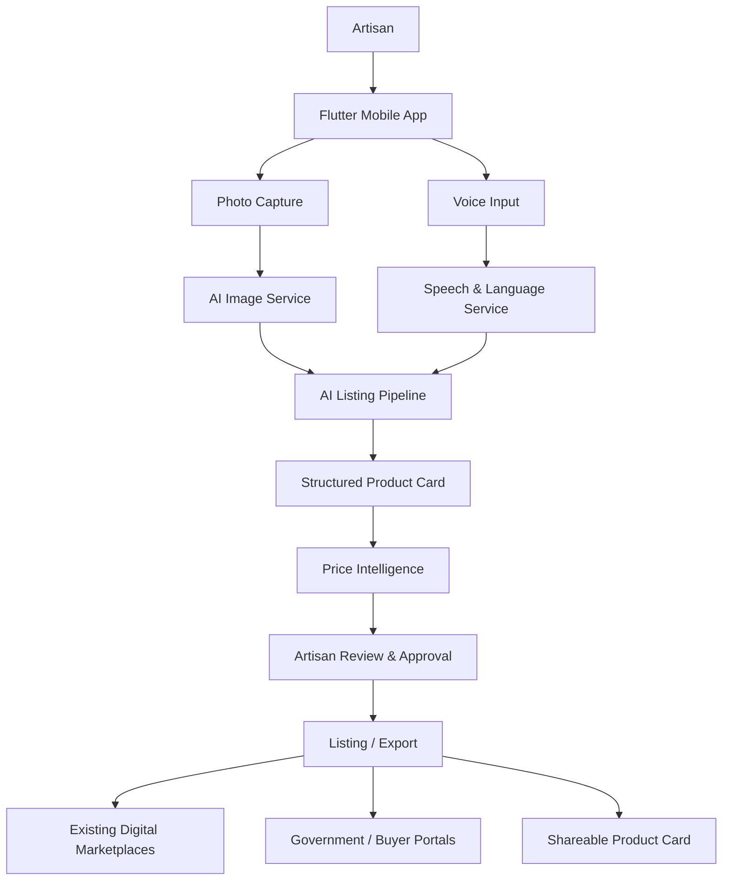
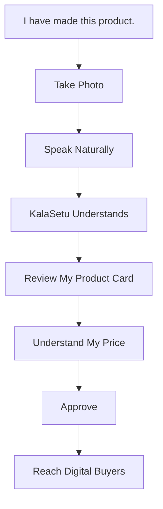

<h1 align="center">KalaSetu</h1>

### AI-powered market linkage and smart cataloging for India's artisans

<p align="center">
  <strong>From craft to catalog — in the artisan's own language.</strong>
</p>

<p align="center">
  <a href="#the-problem">Problem</a> ·
  <a href="#the-solution">Solution</a> ·
  <a href="#how-it-works">How It Works</a> ·
  <a href="#architecture">Architecture</a> ·
  <a href="#technology">Technology</a> ·
  <a href="#getting-started">Getting Started</a>
</p>

<p align="center">


</p>

---

## About KalaSetu

**KalaSetu** is an AI-driven, voice-first cataloging and market-linkage platform designed for marginalized artisans, micro-entrepreneurs, and craft communities.

The platform turns a simple **product photograph and spoken description** into a structured digital product listing — without requiring the artisan to type long forms, write product descriptions, understand complex e-commerce workflows, or depend entirely on physical fairs for market access.

> **Photo + Voice → AI Product Card → Price Intelligence → Market-Ready Listing**

KalaSetu is being developed for **Smart India Hackathon 2026, Problem Statement SIH26090 — “AI-Driven Market Linkage and Smart Cataloging Mobile Application for Marginalized Artisans.”**

**Team:** Dev Deities
**Theme:** Heritage & Culture
**Category:** Software

---

## The Problem

For many artisans, the hardest part of selling digitally is not making the product.

It is everything that happens **before the product reaches the buyer**.

Traditional craft communities often face several barriers simultaneously:

| Barrier             | What it means in practice                                                                    |
| ------------------- | -------------------------------------------------------------------------------------------- |
| Language & literacy | Digital forms and e-commerce terminology create an onboarding barrier                        |
| Product cataloging  | Creating professional titles, descriptions and specifications is time-consuming              |
| Product photography | Online marketplaces expect cleaner, more consistent product imagery                          |
| Pricing             | Artisans need a defensible price based on materials, labour and market context               |
| Market visibility   | Physical fairs and exhibitions provide limited and intermittent market access                |
| Market intelligence | Artisans have little visibility into demand, trends and comparable products                  |
| Connectivity        | Rural and cluster-based communities may operate under unreliable or low-bandwidth conditions |

The result is a structural gap:

**The artisan can create the product, but the digital infrastructure required to sell it is often designed for someone else.**

---

# The Solution

KalaSetu removes that complexity from the artisan's side.

Instead of asking an artisan to manually construct an e-commerce listing, KalaSetu captures the information naturally:

### 1. Capture

The artisan photographs the product using the mobile application.

### 2. Speak

The artisan describes the product naturally in their preferred Indian language.

### 3. Understand

AI processes the image and voice input to identify relevant product information.

### 4. Generate

KalaSetu converts the information into a structured product specification and professional listing.

### 5. Price

The system provides an explainable price range using factors such as:

* Material cost
* Labour / time
* Wage assumptions
* Comparable market information
* Market band
* Confidence

### 6. Review

The artisan can inspect, correct and approve the generated information.

### 7. Distribute

The resulting product information can be packaged for downstream channels and marketplaces.

---

## The Core Idea


The prototype architecture is deliberately centered around the critical journey:

**Photo → Voice → AI Product Card → List**

This keeps the system focused on proving the most important user outcome before expanding integrations.

---

# Why KalaSetu Is Different

KalaSetu is not another marketplace.

It is the **intelligence and accessibility layer between the artisan and existing digital markets**.

Instead of creating another closed marketplace and expecting artisans to migrate to it, KalaSetu prepares their products for digital distribution.

### Voice-first

The artisan communicates naturally instead of navigating text-heavy forms.

### Multilingual

Speech can pass through language-processing services to support regional-language workflows.

### AI-assisted cataloging

The system transforms unstructured image and voice input into structured product information.

### Explainable pricing

Pricing is designed as an explainable range rather than an opaque AI-generated number.

### Offline-aware

Product capture should remain possible when connectivity is unreliable, with synchronization handled when connectivity becomes available.

### Artisan-controlled

The artisan remains the source of truth for product information, pricing and approval.

### Integration-first

KalaSetu is designed to connect to existing digital-commerce and government ecosystems rather than attempting to replace them.

---

# How It Works



---

# AI Pipeline

The AI layer is the core of KalaSetu.

```text
Image ───────────────┐
                     │
                     ▼
              ┌──────────────┐
              │ Vision Layer │
              └──────┬───────┘
                     │
                     │
Voice ─> Speech ─> Language
                     │
                     ▼
              ┌──────────────┐
              │ Listing Agent│
              └──────┬───────┘
                     │
                     ▼
             Structured Product
                  Specification
                     │
                     ▼
              ┌──────────────┐
              │ Price Engine │
              └──────┬───────┘
                     │
                     ▼
              Explainable Range
```

### Image Intelligence

The image pipeline is intended to assist with:

* Product-background separation
* Image cleanup
* Lighting improvement
* Consistent product presentation
* Product visual understanding

The current solution research includes **BiRefNet** for background processing and lightweight vision approaches for mobile-constrained environments.

### Voice Intelligence

The voice pipeline is designed around:

```text
Artisan Speech
      ↓
Speech Recognition
      ↓
Language Processing
      ↓
Structured Fields
      ↓
Confirmation / Correction
```

KalaSetu uses **Bhashini** as part of its language-processing architecture.

A key UX principle is correction rather than repetition:

> If one word is misunderstood, the artisan should be able to correct that part instead of starting the entire process again.

### Listing Intelligence

The listing service transforms spoken information into structured product fields.

Example:

```text
Artisan says:

"This is a handwoven Pashmina shawl from Kashmir.
It took around twelve days to make and uses
traditional weaving techniques."
               ⬇
Structured Product Card
Craft:        Pashmina
Region:       Kashmir
Product:      Handwoven Shawl
Technique:    Traditional Weaving
Labour Time:  ~12 days
Language:     Hindi / English
```

The generated information remains subject to artisan review and approval.

### Price Intelligence

KalaSetu does not treat an image as sufficient evidence for a price.

Instead, the pricing workflow is designed around:

```text
Material Cost
      +
Labour / Hours
      +
Wage Assumption
      +
Comparable Market Data
      +
Market Band
      ↓
Explainable Price Range
      +
Confidence
```

This makes the pricing recommendation inspectable rather than a black-box number.

---

# Offline-First Design

Connectivity should not become a prerequisite for creating a product listing.

KalaSetu separates **capture** from **processing**.

```text
              MOBILE DEVICE

       ┌─────────────────────────┐
       │ Photo + Voice Capture   │
       └────────────┬────────────┘
                    │
                    ▼
       ┌─────────────────────────┐
       │ Local SQLite Queue      │
       └────────────┬────────────┘
                    │
             Connectivity
                  Available?
                 /         \
               No           Yes
               │             │
               ▼             ▼
           Keep Local      Sync
                             │
                             ▼
                    Backend Processing
                             │
                             ▼
                       AI Pipeline
```

The design target is to allow artisans to continue capturing product information in low-connectivity environments and synchronize processing when network access becomes available.

---

# System Architecture

KalaSetu follows a modular monorepo architecture.


The repository is organized around independently deployable application concerns while sharing contracts and branding through common packages.

---

# Technology

| Layer                   | Technology                           |
| ----------------------- | ------------------------------------ |
| Mobile                  | Flutter / Dart                       |
| Web                     | Next.js / React                      |
| Backend                 | Python / FastAPI                     |
| AI orchestration        | LangChain / LangGraph                |
| Vision                  | BiRefNet + lightweight vision models |
| Speech / Language       | Bhashini, Sarvam and speech adapters         |
| Database                | PostgreSQL, Fire-Store                      |
| Offline storage         | SQLite                               |
| Background jobs / cache | Redis                                |
| Object storage          | S3-compatible object storage         |
| API contracts           | Shared contracts package             |
| Containerization        | Docker / Docker Compose              |

The technology choices are driven by the constraints of the problem rather than by introducing unnecessary infrastructure.

---

# Repository Structure

```text
SIH2K26/
│
├── apps/
│   │
│   ├── mobile/                     # Flutter artisan application
│   │   └── lib/
│   │       ├── ui/
│   │       ├── voice/
│   │       ├── services/
│   │       └── ...
│   │
│   ├── web/                        # Next.js web application
│   │   └── src/
│   │       ├── app/
│   │       ├── components/
│   │       ├── voice/
│   │       └── lib/
│   │
│   └── api/                        # FastAPI backend
│       └── src/
│           └── kalasetu_api/
│               ├── routers/
│               ├── engines/
│               └── adapters/
│
├── packages/
│   ├── brand/                      # Shared visual identity
│   └── contracts/                  # Shared schemas / interfaces
│
├── seed/                           # Development / seed data
├── docs/                           # Technical documentation
├── agent-coding-guide/             # Engineering source of truth
├── AGENTS.md
├── docker-compose.yml
├── .env.example
├── LICENSE
└── README.md
```

---

# Product Surfaces

KalaSetu is designed around three primary interfaces.

## Artisan Mobile App

The primary interface for the artisan.

Core workflow:

```text
Language
   ↓
Authentication
   ↓
Capture Product
   ↓
Voice Description
   ↓
AI Product Card
   ↓
Price Suggestion
   ↓
Review
   ↓
Publish / Export
```

The mobile application is built with Flutter.

## Web Workspace

The web application provides the operational and administrative layer around the product workflow.

It is designed to support:

* Listing management
* Product review
* Catalog workflows
* Voice interaction
* Cluster-level visibility
* Product intelligence
* Administrative operations

## Shareable Product Card

The product card acts as the bridge between KalaSetu and downstream channels.

It can be used for:

* Buyer sharing
* WhatsApp distribution
* Product information packs
* Marketplace preparation
* Government / institutional workflows

---

# Design Principles

### 01 — Voice before forms

The artisan should not need to become an e-commerce operator to sell digitally.

### 02 — Human approval before publication

AI generates and assists. The artisan remains in control.

### 03 — Explainability before automation

Price recommendations should expose their reasoning.

### 04 — Offline capture before perfect connectivity

The workflow should degrade gracefully when the network does not.

### 05 — Existing rails before new marketplaces

KalaSetu prepares information for existing ecosystems rather than creating another isolated marketplace.

### 06 — Lightweight at the edge

Expensive processing belongs on the server where possible; mobile-side components should respect low-end Android constraints.

### 07 — Preserve cultural context

AI-generated descriptions should not erase the artisan's original language, terminology, regional identity or craft context.

---

# Feasibility Strategy

KalaSetu is intentionally built around technologies and infrastructure that already exist.

The implementation strategy is:

```text
AI Band First
Image → Voice → Listing → Price

             ↓

      Core Workflow

             ↓

      Gateway / Export

             ↓

     External Adapters
```

This allows the prototype to prove the fundamental artisan journey before depending on external marketplace integrations.

The solution is designed around constraints identified in the SIH solution proposal, including low bandwidth, speech recognition errors, pricing cold-start problems and dependency on external portals.

---

# Impact

The intended transformation is:

```text
BEFORE

Artisan
   ↓
Physical Fair
   ↓
Trader / Intermediary
   ↓
Limited Buyer Access


AFTER

Artisan
   ↓
Photo + Voice
   ↓
KalaSetu
   ↓
AI Product Card
   ↓
Explainable Pricing
   ↓
Digital Listing
   ↓
Multiple Buyer Channels
```

### Intended outcomes

**Economic access**

Enable year-round digital product discovery instead of relying exclusively on periodic fairs.

**Artisan agency**

Keep ownership of the product information, price and listing with the artisan.

**Reduced digital friction**

Replace complex forms and manual cataloging with voice-first interaction.

**Cultural continuity**

Make traditional craft economically viable without stripping away its regional identity.

**Market intelligence**

Give artisans better visibility into product trends, demand and market context.

---

# Impact Metrics

The prototype will be evaluated against measurable user and system outcomes rather than feature count.

| Metric                      |                                   Target |
| --------------------------- | ---------------------------------------: |
| Time to first product card  |                                  < 5 min |
| Supported language workflow | 22 languages / dialect-oriented pipeline |
| Product-description quality |                             ≥ 90% target |
| Offline capture             |                                Supported |
| Artisan approval            |        Required before final publication |
| Pricing                     |           Explainable range + confidence |
| Critical user journey       |      Photo → Voice → Product Card → List |

These are **project targets for validation**, not claims of achieved production performance.

---

# Validation Strategy

The system should ultimately be tested with real artisan workflows rather than only synthetic datasets.

### Pilot

Start with a focused craft cluster.

Example:

```text
Pilot Cluster
     ↓
Artisan Onboarding
     ↓
Product Capture
     ↓
AI Listing Generation
     ↓
Human Correction
     ↓
Price Validation
     ↓
Buyer Interest
     ↓
Repeat Usage
```

### Key measurements

* Time required to create the first listing
* Voice transcription success rate
* Number of corrections per listing
* AI description acceptance rate
* Pricing recommendation acceptance
* Product-card completion rate
* Listing completion rate
* Buyer engagement
* Repeat artisan usage

---

# Current Development Status

🚧 **Active Development — SIH 2026**

KalaSetu is being developed as a working prototype for Smart India Hackathon 2026.

The repository currently contains:

* Flutter mobile application
* Next.js web application
* Python backend services
* Authentication and session workflows
* Voice-related functionality
* AI / processing engines
* Pricing workflows
* Shared contracts and branding
* Development infrastructure
* Seed data and documentation

The architecture and APIs are expected to evolve during implementation.

---

# Getting Started

## Prerequisites

Recommended development environment:

* Git
* Python 3.12+
* Flutter SDK
* Node.js
* pnpm / npm
* Docker
* PostgreSQL
* Redis

Depending on the application being developed, not every dependency is required.

---

## Clone the repository

```bash
git clone https://github.com/noNameDS09/SIH2K26.git
cd SIH2K26
```

---

## Configure environment variables

```bash
cp .env.example .env
```

Add the required service configuration to `.env`.

Do not commit:

* API keys
* Access tokens
* Passwords
* Private credentials
* Production secrets
* Personal user data

---

# Run the Web Application

```bash
cd apps/web
npm install
npm run dev
```

The development server will be available at:

```text
http://localhost:3000
```

---

# Run the Backend

From the repository root, install the API dependencies according to the current backend environment configuration. See [API docs](./apps/api/README.md)

Then run:

```bash
cd apps/api
uv run uvicorn app.main:app --reload
```

The exact backend entry point may evolve as the API architecture develops.

---

# Run the Mobile Application

Ensure Flutter is installed and a physical Android device or emulator is available.

```bash
cd apps/mobile
flutter pub get
flutter devices
flutter run
```

For physical-device testing, enable USB debugging on the Android device.

---


Use the service-specific documentation under `docs/` for database, storage and environment configuration.

---

# Development Workflow

Development should happen on feature branches rather than directly on `main`.

```bash
git switch main
git pull --ff-only origin main

git switch -c feature/<name>
```

After implementation:

```bash
git status
git add .
git commit -m "feat: <description>"
git push -u origin feature/<name>
```

Pull requests should be reviewed before merging into `main`.

---

# Engineering Documentation

The repository separates product documentation from implementation guidance.

```text
docs/
    architecture
    api
    ai
    deployment
    decisions
```

The `agent-coding-guide/` directory contains implementation guidance for coding agents and should be treated as an engineering source of truth.

---

# Research Foundation

The solution is informed by work across:

### Government & Digital Infrastructure

* Smart India Hackathon 2026
* Ministry of Social Justice and Empowerment
* Bhashini
* Sarvam AI
* Government e-Marketplace (GeM)
* ONDC
* IndiaHandmade
* PM Vishwakarma

### AI / ML

* BiRefNet
* Lightweight mobile vision models
* Speech recognition
* Multilingual NLP
* LangChain
* LangGraph
* Explainable pricing models

### Systems

* Flutter
* Next.js
* Python
* FastAPI
* PostgreSQL
* SQLite
* Redis
* Docker

The project's solution deck also documents the research basis behind the AI, mobile, backend, language and offline-sync choices.

---

# Roadmap

### Phase 1 — Core Prototype

* [x] Mobile application foundation
* [x] Web application foundation
* [x] Backend foundation
* [x] Authentication flow
* [x] Product workflow
* [x] Voice workflow foundation
* [x] Pricing workflow foundation

### Phase 2 — AI Pipeline

* [x] Production-grade image processing
* [x] Multilingual speech pipeline
* [x] Structured listing generation
* [x] Listing-quality evaluation
* [x] Explainable pricing model
* [x] Confidence estimation

### Phase 3 — Field Readiness

* [x] Offline queue hardening
* [x] Synchronization and conflict handling
* [ ] Low-bandwidth optimization
* [ ] Artisan usability testing
* [ ] Craft-specific vocabulary evaluation

### Phase 4 — Market Integration

* [ ] Export packs
* [ ] Government marketplace adapters
* [ ] ONDC integration
* [ ] Buyer-facing discovery
* [ ] Market trend intelligence

---

# What Success Looks Like

KalaSetu succeeds when an artisan can do this without needing technical expertise:



The goal is not to make artisans adapt to technology.

**The goal is to make technology adapt to artisans.**

---

# Team

## Dev Deities

Building KalaSetu for **Smart India Hackathon 2026 — PS SIH26090**.

| Area           | Responsibility                                         |
| -------------- | ------------------------------------------------------ |
| Product        | Problem discovery, user workflow, solution design      |
| AI / ML        | Vision, speech, NLP, listing intelligence, pricing     |
| Backend        | APIs, business logic, integrations, data               |
| Mobile         | Flutter application and offline workflows              |
| Web            | Next.js workspace and operational interfaces           |
| Infrastructure | Containers, storage, deployment and system integration |

---

# License

This project is licensed under the **MIT License**.

See [`LICENSE`](./LICENSE) for details.

---
<div align="center">
<h3>KalaSetu</h3>
<strong>Traditional craft deserves a digital future.</strong>
<br>
Built with technology, designed around the artisan.
<br>
<strong>Smart India Hackathon 2026 · PS SIH26090 · Team Dev Deities</strong>
</div>
